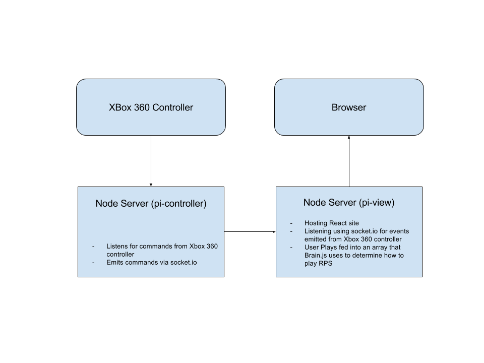

# node_mind-prs

## Overview

This project is a simple AI/Neural Network using brain.js which is a simple JavaScript Neural Network. It attempts to learn how to play Rock-Paper-Scissors by a simple neural network that is fed the correct way of responding to a particular RPS play.

